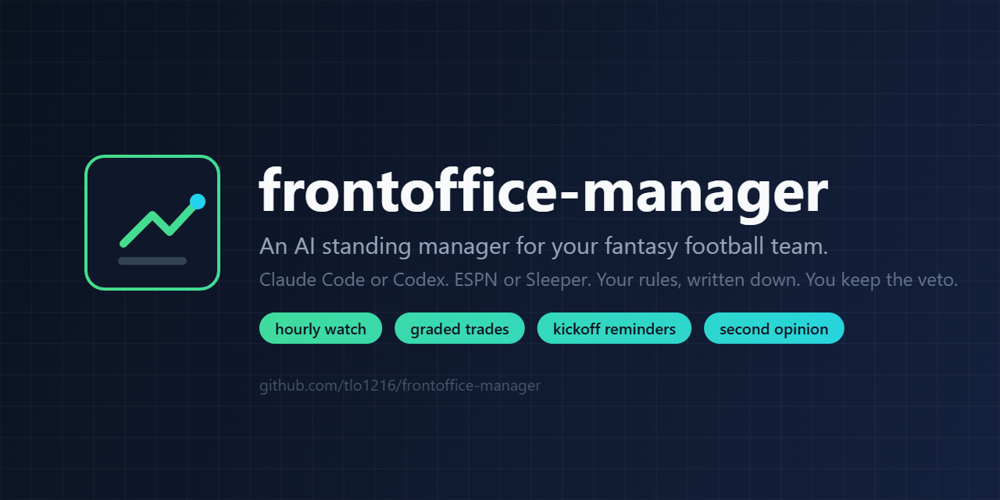
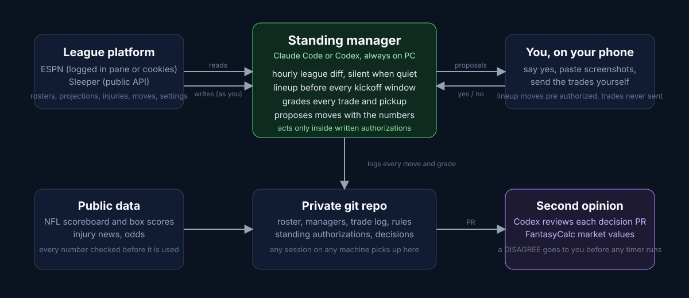

<p align="center">
  
</p>

<p align="center">
  <a href="START-HERE.md"></a>
  <a href="TRY-IT.md"></a>
  <a href="docs/example-week.md"></a>
  <a href="FREE-TIER.md"></a>
  <a href="NO-COMPUTER.md"></a>
  
  
  
  
</p>

**frontoffice-manager** turns a coding agent into a standing manager for your fantasy football, basketball or baseball team. It reads your league every hour, sets your lineup before every kickoff, grades every trade and pickup in the league with projections and market values, proposes moves with the numbers, and keeps a written record of everything in a private repo. You keep the veto: lineup moves are pre authorized, adds and drops need your yes or a timer you define, and trades are never sent by the agent.

It is the sanitized version of a setup that has run a real eight team ESPN league since the 2026 draft.

**Before you install anything:** [see what a week of output looks like](docs/example-week.md), or [run it read only against a public league](TRY-IT.md) with no cookies, no API keys and no write access.

**No AI subscription?** The analysis half of this kit calls no model at all. [The free tier](FREE-TIER.md) runs it in GitHub Actions with no computer, no subscription and no cost: lineup efficiency, all-play record, value over replacement, buy and sell boards, and a simulated win probability, committed to your own repo every Tuesday. It tells you what to do; it just will not do it for you.

**No computer that can stay on?** That is the real barrier to this kit, and there are [three ways around it](NO-COMPUTER.md): Claude Code on the web, which needs no machine at all and can run the recurring passes on a schedule, or a permanently free cloud VM you own.

<p align="center">
  
</p>

## Quick start

1. Click **Use this template** and make the copy **private**. It will hold candid notes about the people in your league.
2. Clone it to a computer that can stay on. `SETUP.md` has the two commands that stop Windows or a Mac from sleeping.
3. Open Claude Code or Codex in that folder and paste the one message in [`START-HERE.md`](START-HERE.md). Read [`TIPS.md`](TIPS.md) for the setup that actually works: leave it running on a machine that never sleeps and drive it from your phone.
4. Answer its questions. It reads your league, writes the files, sets your lineup, and schedules itself.

No server, no bot account, no scraping. Reads go through the same league API the apps use. Writes happen in the platform's own page, as you.

## What it does every week

| When | What |
|---|---|
| Hourly, 7 AM to 11 PM | Diff rosters, moves, pending claims, injuries, waiver order and settings. Silent when nothing changed. Grades and re ranks when something did. |
| 90 minutes before each kickoff window | Verify starters are active, compare to the bench, fix the lineup, tell you. |
| Once a week | Searches the whole league for trades, scores both sides by what each lineup gains or loses, and hands you ranked suggestions with the message to send. It never sends one. |
| Tuesday morning | Week is final. Waiver targets versus your weakest bench spots, proposed claims with drops, next week's reminders. |
| When you paste a screenshot | Updates its picture of the league from your app or group chat and tells you what changed. |
| Draft week | Builds the value board, sets your pre ranked list for autodraft, runs the live assistant in the draft room. |
| Before any decision it would make alone | Opens a decision PR reviewed by Codex, or by GPT, Gemini and Claude through their APIs, with a weighted consensus. A disagreement reaches you first. |

## What is in the box

```
START-HERE.md        the one message that sets everything up, for Claude Code or Codex
SETUP.md             the machine: staying awake, tools, the ESPN login, restarts
SECURITY.md          every risk, including the inconvenient ones. Read before you add credentials
FEEDBACK.md          how to tell me what broke, or what worked
AUTONOMY.md          how much it does for you (levels 0 to 4) and which models it uses
TIPS.md              how to actually run it: always on machine, phone remote, widening its authority
KEYS.md              optional: your own API keys for GPT, Gemini and Claude as reviewers
DRAFT.md             draft day: the value board, autodraft through your pre ranked list, live assistant
ESPN-MCP.md          ESPN without the browser: a local MCP server for reads and validated writes
CHATGPT-TUNNEL.md    optional: ask ChatGPT about your league, read-only, over a private tunnel
YAHOO-SETUP.md       Yahoo leagues: the five minute sign in
CLAUDE.md            instructions the agent reads in your private repo
AGENTS.md            instructions Codex follows when it reviews decisions
manager-session.md   the full standing manager prompt, if you prefer to paste it yourself
league/              templates the agent keeps current: roster, managers, settings, trade log,
                     standing authorizations
rules/               one file per standing rule, in the agent's own memory format; edit to change behavior
decisions/           the cross review protocol and template
tools/               ESPN (football, basketball, baseball) and Sleeper cheat sheets, free NFL,
                     NBA and MLB data sources, snapshot scripts, the diff, the decision PR script,
                     the multi model reviewer
docs/                banner and architecture diagram
```

## Design choices worth knowing

- **Trades are always yours.** The agent evaluates both sides, grades them and drafts the message. It never sends, accepts or rejects one, and no setting changes that.
- **You pick how much it does.** Five levels, from answering questions to running the roster on its own, and three model tiers from best to economy. Asked at setup, changeable in a sentence. See AUTONOMY.md.
- **Written authorizations, not vibes.** What the agent may do alone lives in one file you edit. The default is lineup moves only.
- **Numbers are never fudged.** Grades and prose can have a point of view; projections, deltas and scores are always what the source says.
- **Two opinions on every trade.** ESPN projections for the median and FantasyCalc market values for what other managers think a player is worth.
- **Official data, not just the app.** nflverse schedules set the lock reminders; the official injury report and depth charts are checked before every lineup call. See tools/optional-integrations.md for what was evaluated and why.
- **Other models before autonomous action.** Decisions become pull requests that Codex reviews, or a script sends them to GPT, Gemini and Claude reviewers through their APIs and records a weighted consensus. A disagreement reaches you before anything happens.
- **Cost aware, and your call.** Hourly polling with a silent exit, the large model for judgment, a smaller one for mechanical edits. Every model is a setting you choose: stronger models grade better and cost more, and KEYS.md says which jobs tolerate a cheaper one.
- **Two ESPN interfaces.** The browser pane needs nothing installed; the MCP server needs ten minutes and removes the pane from the loop. Either way the same rules and authorizations apply.
- **Restart safe.** Reminders live in the session; the repo lets any session on any machine pick up where the last one stopped.

## ESPN without the browser

The default ESPN path is the agent's browser pane. The better one is a small local MCP server that reads and writes ESPN with your own session cookies: reads, a snapshot in the hourly diff's format, a lineup suggestion, and writes that validate eligibility, locks and roster limits in a dry run before anything is sent. No trade tools. Open source at https://github.com/tlo1216/espn-fantasy-mcp: clone, npm install, npm run build, add your cookies, register it. See ESPN-MCP.md.

## Ask ChatGPT about your league

Optional, and read-only. OpenAI's Secure MCP Tunnel connects the same local ESPN MCP server to the ChatGPT app, so you can ask "who do I start at flex" from your phone without opening the repo. The tunnel makes an outbound connection from your PC: no open port, no public URL, no OAuth server to build. The wrapper that launches the server for ChatGPT forces writes off for that process, so the connector can read everything and execute nothing, while your agent keeps whatever write access you gave it. Your OpenAI key is typed into a hidden local prompt and never enters a chat. See CHATGPT-TUNNEL.md.

## Draft day

Before the season the agent builds a value board from your league's own slots, scoring and projections, walks you through the tiers, and turns it into the pre ranked list your platform uses to autodraft for you if you are not there. If you are there, "draft mode" makes it read every pick through the API and answer within seconds with one recommendation and two alternatives. See DRAFT.md.

## Yahoo

Yahoo has the only official fantasy API, with reads and writes for football, basketball, baseball and hockey behind OAuth. The kit ships a five minute setup (`YAHOO-SETUP.md`: make the app, paste two values, run one script, paste one code; the script finds your league and team by itself), a snapshot script that feeds the same hourly diff, and a cheat sheet with every endpoint the agent uses. Yahoo does not publish projections through the API, so the snapshot fills them from Sleeper's projections by name and says so when it cannot.

## Basketball and baseball

Daily sports change the rhythm, not the rules. The agent runs a lineup pass every morning and again before the first tip or pitch, benches players without a game, streams within your league's add limits, handles the IL from the official feeds (MLB transactions, the NBA injury report), and does category math when the league is not points based. Cheat sheets for the ESPN basketball and baseball APIs and for free NBA and MLB data are in `tools/`; the rule is `rules/daily-sports.md`. These paths were adapted from a running football league and are marked as not yet exercised on a live basketball or baseball league; the agent reports every assumption it makes in the first week.

## Risks

This hands an agent your fantasy credentials and, if you let it, the ability to change your roster while you sleep. [SECURITY.md](SECURITY.md) lists every risk plainly: ESPN cookies are full account access and sit in a text file, automating ESPN is a gray area in its terms, roster moves have no undo, your league mates can try to steer the agent through anything it reads, and the private repo holds candid notes about real people. Read it before you paste a cookie.

## Honest limits

- The ESPN login lasts about a month, then you log in again. Sleeper reads need no login at all. Yahoo needs a developer app and one pasted code, then refreshes itself.
- Without a browser pane (Codex, a terminal only agent) the agent proposes writes and you tap confirm. Everything else is identical.
- Projections are the platform's. The agent adds judgment, news and market data, not a better model.
- It will tell you when your idea is bad. That is the point.

## Feedback

Tell your agent "file feedback about X" and it drafts the issue, strips anything secret, shows it to you and posts it only if you say yes. Or open one yourself: [something broke](https://github.com/tlo1216/frontoffice-manager/issues/new?template=bug.md), [an idea](https://github.com/tlo1216/frontoffice-manager/issues/new?template=idea.md), [it worked](https://github.com/tlo1216/frontoffice-manager/issues/new?template=story.md), or [ask a question](https://github.com/tlo1216/frontoffice-manager/discussions). Details and the never-paste-this list are in [FEEDBACK.md](FEEDBACK.md).

## License

MIT. Use it, fork it, run your own league with it.
