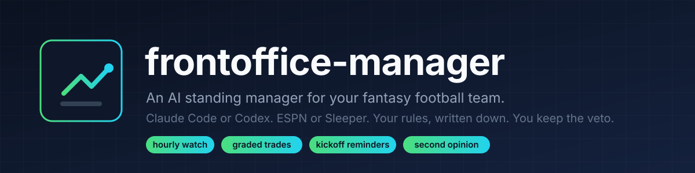

<p align="center">
  
</p>

<p align="center">
  <a href="START-HERE.md"></a>
  
  
  
</p>

**frontoffice-manager** turns a coding agent into a standing manager for your fantasy football team. It reads your league every hour, sets your lineup before every kickoff, grades every trade and pickup in the league with projections and market values, proposes moves with the numbers, and keeps a written record of everything in a private repo. You keep the veto: lineup moves are pre authorized, adds and drops need your yes or a timer you define, and trades are never sent by the agent.

It is the sanitized version of a setup that has run a real eight team ESPN league since the 2026 draft.

<p align="center">
  
</p>

## Quick start

1. Click **Use this template** and make the copy **private**. It will hold candid notes about the people in your league.
2. Clone it to a computer that can stay on. `SETUP.md` has the two commands that stop Windows or a Mac from sleeping.
3. Open Claude Code or Codex in that folder and paste the one message in [`START-HERE.md`](START-HERE.md).
4. Answer its questions. It reads your league, writes the files, sets your lineup, and schedules itself.

No server, no bot account, no scraping. Reads go through the same league API the apps use. Writes happen in the platform's own page, as you.

## What it does every week

| When | What |
|---|---|
| Hourly, 7 AM to 11 PM | Diff rosters, moves, pending claims, injuries, waiver order and settings. Silent when nothing changed. Grades and re ranks when something did. |
| 90 minutes before each kickoff window | Verify starters are active, compare to the bench, fix the lineup, tell you. |
| Tuesday morning | Week is final. Waiver targets versus your weakest bench spots, proposed claims with drops, next week's reminders. |
| When you paste a screenshot | Updates its picture of the league from your app or group chat and tells you what changed. |
| Before any decision it would make alone | Opens a decision PR that a second model reviews. A disagreement reaches you first. |

## What is in the box

```
START-HERE.md        the one message that sets everything up, for Claude Code or Codex
SETUP.md             the machine: staying awake, tools, the ESPN login, restarts
CLAUDE.md            instructions the agent reads in your private repo
AGENTS.md            instructions Codex follows when it reviews decisions
manager-session.md   the full standing manager prompt, if you prefer to paste it yourself
league/              templates the agent keeps current: roster, managers, settings, trade log,
                     standing authorizations
rules/               one file per standing rule, in the agent's own memory format; edit to change behavior
decisions/           the cross review protocol and template
tools/               ESPN and Sleeper API cheat sheets, snapshot scripts (browser pane and cookie based),
                     the hourly diff, the decision PR script
docs/                banner and architecture diagram
```

## Design choices worth knowing

- **Written authorizations, not vibes.** What the agent may do alone lives in one file you edit. The default is lineup moves only.
- **Numbers are never fudged.** Grades and prose can have a point of view; projections, deltas and scores are always what the source says.
- **Two opinions on every trade.** ESPN projections for the median and FantasyCalc market values for what other managers think a player is worth.
- **A second model before autonomous action.** Decisions become pull requests that Codex reviews; the record is the merged file.
- **Cost aware.** Hourly polling with a silent exit, the large model for judgment, a smaller one for mechanical edits.
- **Restart safe.** Reminders live in the session; the repo lets any session on any machine pick up where the last one stopped.

## Honest limits

- The ESPN login lasts about a month, then you log in again. Sleeper reads need no login at all.
- Without a browser pane (Codex, a terminal only agent) the agent proposes writes and you tap confirm. Everything else is identical.
- Projections are the platform's. The agent adds judgment, news and market data, not a better model.
- It will tell you when your idea is bad. That is the point.

## License

MIT. Use it, fork it, run your own league with it.
